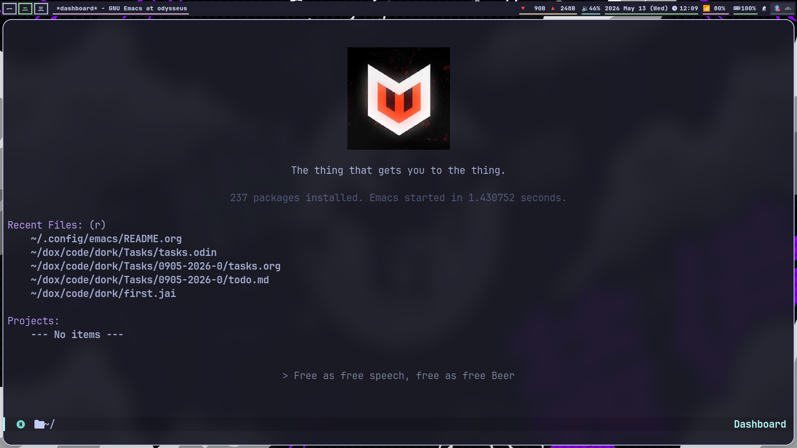

#+TITLE: Emacs Configuration
#+AUTHOR: Swarnaditya Singh
#+EMAIL: swarnadityasingh@pm.me
#+OPTIONS: toc:nil num:nil

Yeah, I finally got time to fix my emacs configuration. Also this one now stays in the =$XDG_CONFIG_HOME/emacs= instead of =$HOME/.emacs.d=, it's so much better now that it doesn't clutter my home directory. Also one important thing, my emacs config no longer supports windows.

Yes, I still prefer emacs from scratch over any of the emacs distro. This preference of mine is very similar to how I use my [[https://github.com/demonkingswarn/nvim][neovim]], which is from scratch as well.

"The thing that gets you to the thing" is a quote from the TV series "Halt and Catch Fire" which I recently watched, and damn this show is just perfect. Mr. Robot and Silicon Valley used to be my favourite shows, but this one tops both of them at once now.

** Installation

Just clone it into your =$XDG_CONFIG_HOME/emacs=

#+begin_src sh
git clone https://github.com/DemonKingSwarn/.emacs.d ~/.config/emacs
#+end_src

Obviously you don't need to contribute back to my config, as it's my preferences. Feel free to change it to the way you like it.
